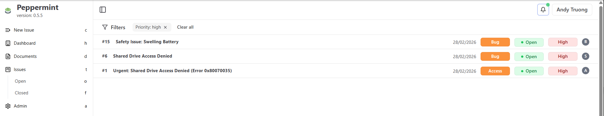
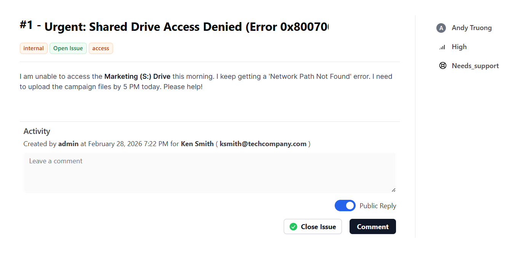
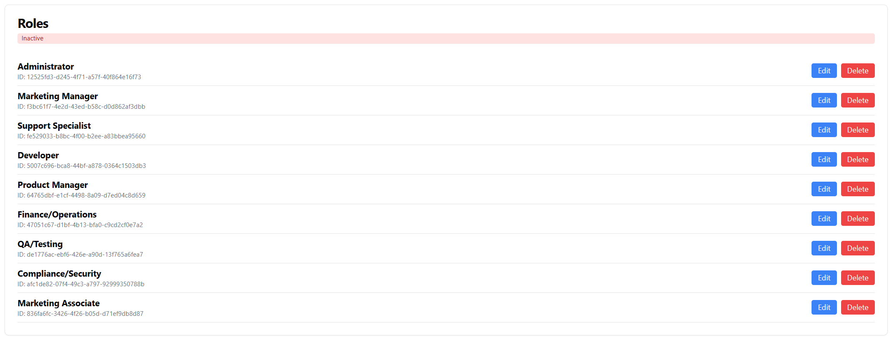
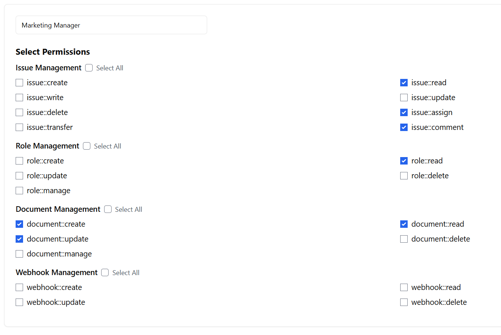
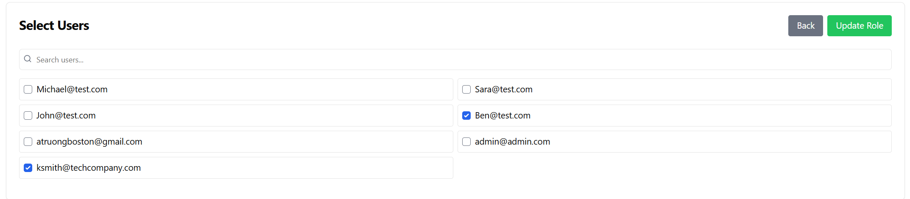
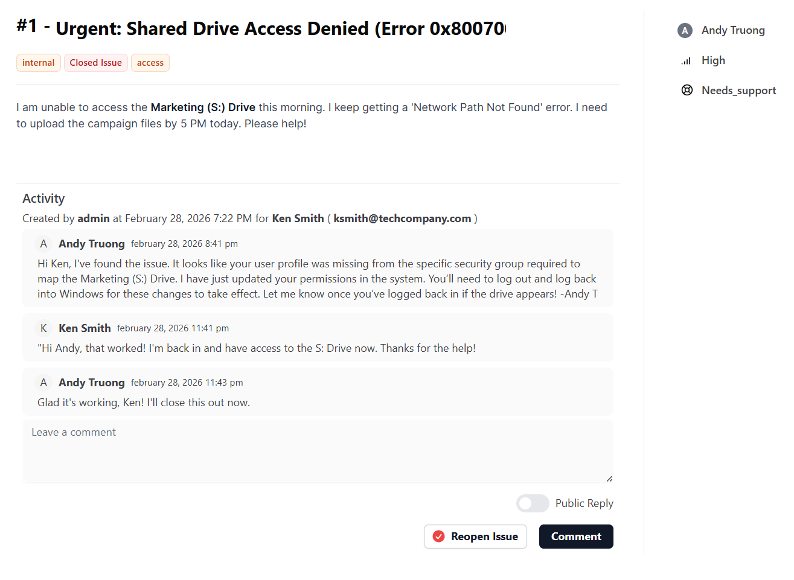

# Shared Drive Access — Permission Misconfiguration

| | |
|---|---|
| **Incident** | User unable to access Marketing shared drive (Error 0x80070035) |
| **Severity** | High — Blocked from critical business resources |
| **Root Cause** | Missing Active Directory security group assignment |
| **Status** | Resolved — Same-day fix |
| **Environment** | Corporate IT environment, March 2026 |

---

## Overview

A new employee couldn't access the company shared drive needed for day-one onboarding and project work. The error message (0x80070035) suggested a network path issue, but the real problem was simpler: the user's AD account wasn't in the right security group. This case study documents how systematic scope-checking and permission analysis turned a high-priority incident into a resolved ticket in under 4 hours.

---

## The Incident

The ticket came in around 7:30 PM on a Friday: a new marketing hire (Ken Smith) couldn't access the shared drive. He had an immediate deadline — campaign files needed uploading — and was locked out.

**What I needed to establish first:**
- Which shared drive? Marketing's S: drive.
- What error exactly? "Network Path Not Found" (0x80070035).
- When did it start? Immediately upon hire — suggests onboarding setup issue, not a temporary outage.
- Device and network? Corporate workstation on the company network — no VPN or remote access complications.

The metadata told a story: new user, immediate access denial, specific drive, specific error. This wasn't a network problem.

**Supporting screenshots:**

---

## Diagnosis Process

Before touching anything, I had two questions: Was this isolated to one user or system-wide? And what's the actual root cause?

**Scope Check**

I verified that other users could access the S: drive fine. Ken's workstation could reach the network and his AD account was active and properly configured. This meant the problem wasn't at the drive level, the network level, or the account level. It was a permissions issue specific to Ken.

**Root Cause**

I pulled up Active Directory and checked Ken's security group memberships. Windows file shares use Access Control Lists (ACLs) that reference AD security groups — if a user isn't in the right group, the ACL denies access regardless of anything else.

Ken was missing from the security group that governs S: drive access. During onboarding, he'd been added to some groups but not the critical one. That's why he got "access denied."

**Diagnosis screenshots:**

---

## Resolution & Closure

With the root cause confirmed, the fix was straightforward.

I added Ken's account to the correct security group in Active Directory and asked him to sign out and back in to refresh his Kerberos token. By 11:41 PM, Ken confirmed access was restored:

> "Hi, that worked! I'm back in and have access to the S: Drive now. Thanks for the help!"

The ticket closed same-day.

**What made this close smoothly:** verification. I didn't just add the group and assume it worked. I waited for the user to confirm the fix actually resolved the problem. That extra step prevents reopens.

**Prevention:** I documented the gap in the onboarding checklist and recommended that the team implement periodic audits of new-hire group assignments. One incident is a data point; multiple incidents suggest a process failure. This way, the same issue doesn't come back in six months.

**Resolution screenshot:**

---

## What This Taught Me

This ticket was technically simple — add a user to a group, done. But it demonstrates something more important: how a structured approach prevents mistakes and builds lasting solutions.

**The methodology matters.** Intake → Scope Check → Root Cause → Resolution → Closure. Follow that, and you don't waste time chasing the wrong problem or miss the documentation that prevents the next incident.

**Communication throughout reduces friction.** I didn't just fix it invisibly; I confirmed every step with the user. That builds confidence and prevents the ticket from bouncing back.

**Prevention is part of the job.** Closing a ticket isn't the end. Preventing the same issue from happening again — through checklist improvements, process documentation, or automation — is what separates support work from support *system*.

---

## Tools & Technologies Used

| Tool | Purpose |
|---|---|
| Active Directory Users and Computers | Managing user accounts and security group memberships |
| Windows File Share / ACL | Diagnosing permission inheritance and access control |
| Network diagnostics | Ruling out connectivity as a contributing factor |
| Ticketing system | Documenting the issue, resolution, and prevention steps |

---

*Case Study — Lab Simulation — March 2026*
